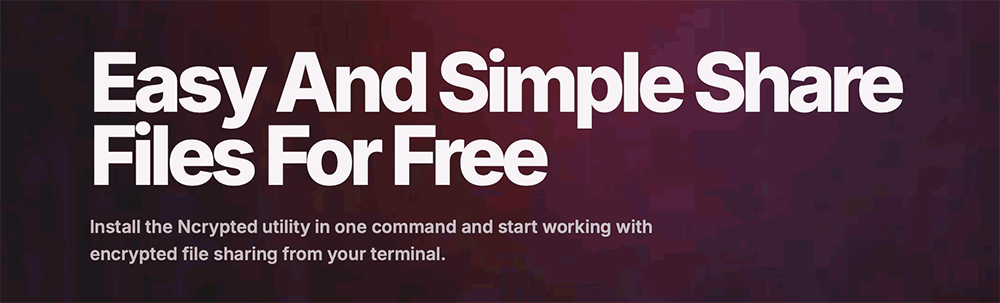

[](https://github.com/ultra-x-coder/ncrypted_cli) [](https://github.com/ultra-x-coder/ncrypted_cli) [](https://github.com/ultra-x-coder/ncrypted_cli) [](https://github.com/ultra-x-coder/ncrypted_cli) [](https://github.com/ultra-x-coder/ncrypted_cli) [](https://github.com/ultra-x-coder/ncrypted_cli) [](https://github.com/ultra-x-coder/ncrypted_cli)[](https://github.com/ultra-x-coder/ncrypted_cli) [](https://github.com/ultra-x-coder/ncrypted_cli) [](https://github.com/ultra-x-coder/ncrypted_cli) [](https://github.com/ultra-x-coder/ncrypted_cli)

<p align="center">
  
</p>

# Ncrypted

**Share files from your terminal — encrypted before they ever leave your machine.**

`ncrypted` is a tiny command-line tool for sending and receiving files securely.
Every file is compressed and encrypted **on your own computer** with a passphrase
only you know. The server only ever stores an unreadable blob — it never sees your
file, its contents, or your passphrase.

> 🔐 **Zero-knowledge by design.** Encryption (AES-256-GCM) and key derivation
> (Argon2id) happen locally. Your passphrase is never uploaded, never logged, and
> can never be recovered for you. **If you lose your passphrase, the file is gone
> forever** — there is no reset.

---

## 📦 Install

One command, on **Linux** or **macOS**:

```bash
curl -fsSL https://ncrypted.app/install.sh | sh
```

This downloads the right build for your system, verifies it, and puts `ncrypted`
on your `PATH`. When it finishes, check it works:

```bash
ncrypted --version
ncrypted            # shows your settings and a short intro
```

If the installer says `~/.local/bin is not in PATH`, add this line to your shell
profile (`~/.bashrc`, `~/.zshrc`, …) and restart your terminal:

```bash
export PATH="$HOME/.local/bin:$PATH"
```

> 💡 Run the same install command again at any time to update to the latest
> version. The client also reminds you when a newer one is available.

---

## 🚀 Quick start

`ncrypted` is smart about what you hand it — a **file path** is an upload, a
**slug or URL** is a download:

```bash
ncrypted ./report.pdf                       # upload a file
ncrypted aB3xZ9                             # download by slug
ncrypted https://ncrypted.app/d/aB3xZ9     # download by URL
```

That's the whole loop: **upload → share the link → the other person downloads.**

---

## ⬆️ Uploading a file

```bash
ncrypted upload report.pdf
```

You'll be asked for a **passphrase** (twice, to confirm). The file is encrypted
locally and uploaded. You get back a **slug** and a shareable **URL**:

```
Uploaded        yes
Slug            aB3xZ9
URL             https://ncrypted.app/d/aB3xZ9
```

Share **both** the URL *and* the passphrase with whoever should open the file —
through separate channels is safest. Without the passphrase, the download is
useless.

Handy options:

```bash
ncrypted upload report.pdf --public                  # anyone with the link can view it in the list
ncrypted upload report.pdf --passphrase "…"          # provide the passphrase inline (skips the prompt)
ncrypted upload report.pdf --public-desc "Q3 report" # a public caption shown next to the file
ncrypted upload report.pdf --private-desc "secret"   # a note encrypted just like the file
ncrypted upload ./my-folder                          # upload a whole directory
ncrypted upload big.iso --archive                    # wrap the encrypted data in a ZIP
ncrypted upload report.pdf -y                        # don't ask for confirmation
```

> Files are **private by default** — only you can list them. `--public` only
> affects visibility; the contents stay encrypted either way.

---

## 🔑 Passphrase requirements

To protect you from trivially crackable files, the passphrase you choose when
**uploading** (or setting a new private note) must be reasonably strong. It must:

- be at least **6 characters** long,
- not be a single repeated character (`aaaaaa`),
- not be a simple sequence (`123456`, `abcdef`),
- not be one of the most common leaked passwords (`password`, `qwerty`, …).

If a passphrase is rejected, you'll see a short message explaining why — just pick
a stronger one. This check only runs when you **create** something new; opening
your existing files is never affected.

> 💪 A short random phrase of a few unrelated words makes a great passphrase.

---

## ⬇️ Downloading a file

```bash
ncrypted download aB3xZ9
```

You'll be asked for the passphrase, the file is decrypted, and saved into the
current folder under its original name. Choose where it lands:

```bash
ncrypted download aB3xZ9 -o /tmp                 # save into a folder, keep the original name
ncrypted download aB3xZ9 -o /tmp/renamed.pdf     # save under a new name
ncrypted download aB3xZ9 --passphrase "…"        # provide the passphrase inline
ncrypted download aB3xZ9 --extract               # if it's an archive, unpack it after decrypting
```

**Typed the wrong passphrase?** No problem — the file is downloaded only once, and
you get **up to 3 tries**. If all three fail, the still-encrypted file is saved
next to you as `name.enc` so the download isn't wasted. You can decrypt it later,
offline, without downloading again:

```bash
ncrypted decrypt report.pdf.enc                  # try again, no network needed
ncrypted decrypt report.pdf.enc -o /tmp
ncrypted decrypt report.pdf.enc --extract        # unpack if it's an archive
ncrypted decrypt report.pdf.enc --remove         # delete the .enc file after success
```

---

## 📂 Managing your files

```bash
# List your uploads
ncrypted list                       # compact table
ncrypted list --full                # every detail, one block per file

# Inspect a single file
ncrypted info aB3xZ9
ncrypted info aB3xZ9 --show-private  # also decrypt and show the private note

# Change the descriptions later
ncrypted update aB3xZ9 --public-desc "new caption"
ncrypted update aB3xZ9 --private-desc "new secret note"

# Delete a file
ncrypted delete aB3xZ9
ncrypted delete aB3xZ9 -y            # skip the confirmation prompt
```

---

## 👤 Accounts (optional)

Out of the box you don't need an account — your uploads are tied to **this
terminal** (device mode). That's perfect for quick, one-off shares.

If you want to manage the **same files from several computers**, create an
account and sign in:

```bash
ncrypted register-user     # create an account (username + password)
ncrypted login-user        # sign in on this device
ncrypted log-out           # sign back out (your device identity is kept)
```

| Mode | What it means |
| --- | --- |
| **Device** | Files belong to this terminal only. No login required. |
| **User** | Files belong to your account and follow you across devices. |

> Your account password and your file passphrases are **different things**. The
> password signs you in; the passphrase encrypts a specific file. The server only
> ever knows the password.

---

## 🐢 Limiting transfer speed

Don't want a big upload or download to saturate your connection? Throttle it:

```bash
ncrypted upload big.iso --max-up 1m         # 1 MB/s up
ncrypted download aB3xZ9 --max-down 500k    # 500 KB/s down
```

Suffixes: `k`, `m`, `g` (decimal) or `ki`, `mi`, `gi` (binary). Use `0` for no
limit.

---

## 📋 Command reference

| Command | What it does |
| --- | --- |
| `ncrypted` | Show your settings and a short intro |
| `ncrypted upload PATH` | Encrypt and upload a file or directory |
| `ncrypted download SLUG` | Download and decrypt a file |
| `ncrypted decrypt FILE.enc` | Decrypt a saved `.enc` file offline |
| `ncrypted list` | List your uploads (`--full`, `--json`) |
| `ncrypted info SLUG` | Show details for one file |
| `ncrypted update SLUG` | Change a file's descriptions |
| `ncrypted delete SLUG` | Delete a file |
| `ncrypted register-user` | Create a permanent account |
| `ncrypted login-user` | Sign in with your account |
| `ncrypted log-out` | Sign out of your account |
| `ncrypted settings` | Print your current settings |

Every command supports `--help` for its full list of options:

```bash
ncrypted --help
ncrypted upload --help
```

---

## ❓ Tips & troubleshooting

- **"Decryption failed — wrong passphrase?"** — Double-check the passphrase. It's
  case-sensitive and must match exactly what was used to upload.
- **Lost the passphrase?** — Unfortunately the file cannot be recovered. This is
  the price of true end-to-end encryption: not even the server can read it.
- **`command not found: ncrypted`** — Make sure `~/.local/bin` is on your `PATH`
  (see [Install](#-install)).
- **Share safely** — Send the link and the passphrase over *different* channels
  (e.g. link by email, passphrase by message) so neither alone is enough.

---

## 📄 License

Apache-2.0
